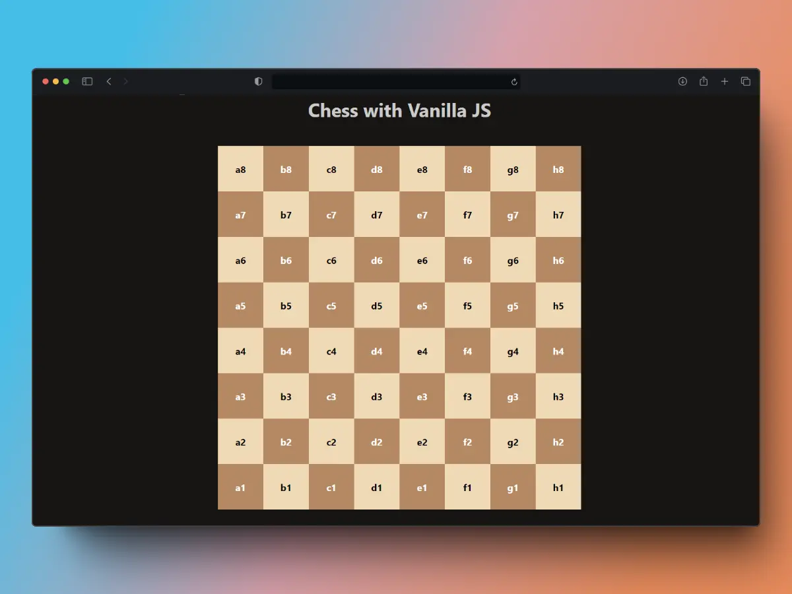

# Chess with Vanilla JS
<div align="center">   
  <a href="https://chess-vanilla-js.vercel.app/">
        ✨ Open project ✨
        <br/>
    </a>
</div>

## Start

```sh
    git clone https://github.com/pierodev0/chess-vanilla-js.git
```




This project involves creating a dynamic chessboard using only pure JavaScript (Vanilla JS), HTML, and CSS. It's an excellent demonstration of how interactive and responsive content can be generated without the use of external frameworks.

## Description

The application generates an 8x8 chessboard where the squares alternate between white and black, following the typical chess pattern. Additionally, JavaScript is used to dynamically manipulate the DOM and generate both the structure and styling functionality of the board. The square size adjusts automatically when resizing the window or visual viewport.

### Features

- **Dynamic generation**: The board is automatically generated based on an array that simulates the positions of the squares.
- **Alternate colors**: White and black squares are alternately colored to follow the standard chess pattern.
- **Responsive**: Squares adjust their size based on changes in window and viewport size.
- **Position control**: A specific position on the board can be accessed using row and column coordinates.


